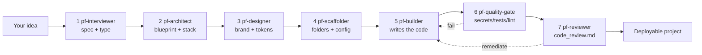
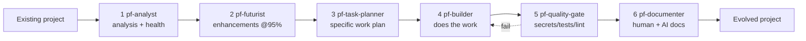
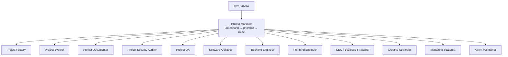

# Project Factory

A personal multi-agent system that turns a project idea into a complete,
deployable project — by orchestrating specialist agents that draw on this repo's
`agents/`, `commands/`, `skills/`, `design-md/`, and `system-designs/` library.

Runs entirely inside **VS Code + GitHub Copilot custom agents**. Zero extra
infra cost — just your Copilot subscription.

## How to use it

1. Open the **Copilot Chat** panel in VS Code.
2. From the agent picker, choose **Project Factory** (or type `@Project Factory`).
3. Describe your idea, e.g.:
   > Build a Next.js finance dashboard that streams live quotes from massive.com.
4. The orchestrator walks 7 stages, **pausing for your approval at each gate**.
   Reply `approve` / `edit ...` / `redo` at every stop.

## The pipeline



| Stage | Agent | Writes? | Pulls from library |
|-------|-------|---------|--------------------|
| 1 Interview | `pf-interviewer` | no | — |
| 2 Architecture | `pf-architect` | no | `system-designs/`, `routing.md` |
| 3 Design | `pf-designer` | no | `design-md/`, `colors.csv` |
| 4 Scaffold | `pf-scaffolder` | yes | `commands/setup/` |
| 5 Build | `pf-builder` | yes | `agents/`, `skills/`, `.github/instructions/` |
| 6 Quality gate | `pf-quality-gate` | runs checks | `hooks/security/`, `hooks/testing/` |
| 7 Review | `pf-reviewer` | `docs/code_review.md` | `code-reviewer`, `security-auditor` |

The orchestrator ([`.github/agents/project-factory.agent.md`](../.github/agents/project-factory.agent.md))
is the only agent you invoke directly; the seven `pf-*` workers are hidden
subagents it delegates to.

## Evolving an existing project

Already have a project (factory-built or not) and want to take it further? Use
the **Project Evolver** agent. It analyzes the real codebase, plans only
*realistic* next steps, does the specific work, and documents everything for
both humans and AI.

1. From the agent picker choose **Project Evolver** (or `@Project Evolver`).
2. Point it at a project, e.g.:
   > Analyze the `dealnav clone/` and plan realistic next features.
3. It walks 6 stages, pausing for approval at each gate.



| Stage | Agent | Writes? | Output |
|-------|-------|---------|--------|
| 1 Analyze | `pf-analyst` | yes | `docs/analysis/project-analysis.md` |
| 2 Future enhancements | `pf-futurist` | yes | `docs/analysis/enhancement-roadmap.md` (≥95%-confidence items only) |
| 3 Specific work plan | `pf-task-planner` | yes | `docs/analysis/work-plan.md` |
| 4 Build the work | `pf-builder` *(reused)* | yes | project code + tests |
| 5 Quality gate | `pf-quality-gate` *(reused)* | runs checks | pass/fail report |
| 6 Document | `pf-documenter` | yes | one human file + AI tree (`AGENTS.md`, `docs/ai/index.md`, `docs/ai/**`) |

The **95% confidence bar** in stage 2 means the futurist only keeps enhancements
it judges ≥95% likely to be both buildable with proven tech today *and* genuinely
useful in real-world applications — everything weaker is reshaped or cut. Stage 6
produces **one consolidated human-readable file** plus a **modular AI doc tree**:
`docs/ai/index.md` routes an agent to small single-concern subsections
(`docs/ai/modules/*`, conventions, glossary…) so it loads only what the current
task needs instead of one giant context blob.

## Documenting a project on its own

Just want docs, without analysis or building? Use the **Project Documentor**
agent. It runs only the documentation stage — producing the single human file
and the modular AI tree — and (for non-trivial projects with no existing
analysis) can ground itself with a quick `pf-analyst` pass first.

1. From the agent picker choose **Project Documentor** (or `@Project Documentor`).
2. Point it at a project, e.g.:
   > Document the `dealnav clone/` for humans and AI.
3. It pauses for approval, then writes `README.md` + `AGENTS.md` + `docs/ai/**`.

## Auditing a project's security

Want a deeper security pass than the general review stage? Use the **Project
Security Auditor** agent. It runs a read-only, OWASP-mapped audit (plus the
repo's `hooks/security/` scanners and a supply-chain check), rates every finding
by severity, and can optionally drive the fixes to green via the builder.

1. From the agent picker choose **Project Security Auditor** (or `@Project Security Auditor`).
2. Point it at a project, e.g.:
   > Security audit the `dealnav clone/`.
3. It writes `docs/analysis/security-audit.md`, then — if you opt in — remediates
   Critical/High findings and re-verifies.

## QA-ing a project

Want a deeper testing pass than the general quality gate? Use the **Project QA**
agent. It maps test coverage, risk-ranks the gaps, writes real tests (unit,
integration, E2E, accessibility), runs the suite, and can hand any bugs it finds
to the builder and re-test.

1. From the agent picker choose **Project QA** (or `@Project QA`).
2. Point it at a project, e.g.:
   > QA the `dealnav clone/` and close the test gaps.
3. It writes `docs/analysis/qa-report.md`, then — after you approve the test plan
   — implements the tests and reports real pass/fail counts.

## Focused building agents (backend / frontend)

For domain-scoped implementation work, invoke a specialist directly:

- **Backend Engineer** — APIs, services, data models, DB, auth, jobs. Follows
  `.github/instructions/backend.instructions.md`, enforces the security
  non-negotiables, and verifies via `pf-quality-gate`. Hands UI work to Frontend.
- **Frontend Engineer** — components, pages, state, styling, accessibility, API
  wiring. Follows `.github/instructions/frontend.instructions.md` and applies a
  `design-md/` brand's exact tokens. Hands API work to Backend.

Each stays strictly in its lane, plans behind an approval gate, then implements
with tests. Use them when you know the work is purely backend or purely frontend;
use **Project Factory** / **Project Evolver** for full features that span both.

## Focused architecture agent

**Software Architect** is the advisory specialist for design decisions: it designs
a new system or reviews an existing one, makes stack/tradeoff choices, defines
boundaries and data flow, and records the result as ADRs + a Mermaid diagram in
`docs/architecture.md` and `docs/adr/`. It grounds every choice in a
`system-designs/` blueprint and **does not write implementation code** — it hands
a concrete build plan to the Backend/Frontend engineers (or `pf-builder`).

## Focused business agent

**CEO / Business Strategist** holds the business and market context: vision, target
customer, competition, business model and monetization, positioning, risks, and the
North-Star metric + KPIs. It researches the market with evidence (cited, dated),
ties every analysis to a decision, and writes `docs/business/strategy-brief.md`
(+ `market-analysis.md`). Advisory — it sets direction and value-ranked priorities,
then hands them to architecture/build or to marketing/creative.

## Focused creative agent

**Creative Strategist** generates ideas and solutions: it diverges into a wide,
varied idea set (product/feature concepts, UX ideas, naming/brand angles, content
concepts), then converges to a shortlist of developed, evaluable concepts. It
anchors everything to the business strategy and audience, draws on
`skills/creative-design/*` and `design-md/` brands, and writes
`docs/creative/concept-brief.md`. Advisory — it hands the lead concept to
build/marketing/frontend.

## Focused marketing agent

**Marketing Strategist** turns the business + creative strategy into a marketing
plan and ready-to-ship materials: positioning/messaging, channel & GTM/launch
plan, content calendar, and assets (landing copy, social posts, emails, SEO). It
inherits `docs/business/strategy-brief.md`, uses `commands/marketing/` publishers
for channel formatting, enforces truthful claims (no invented features/metrics),
and writes `docs/marketing/marketing-plan.md` + `docs/marketing/assets/`. Hands the
landing page to the frontend engineer and visuals to creative.

## One agent to start from — Project Manager

**Project Manager** is the default agent to select for *any* task. You don't have
to know which specialist you need — describe the outcome and it understands the
request, breaks it into prioritized tasks, picks the single best specialist for
each, and coordinates them in dependency order behind approval gates. It routes
to every agent above (the two pipelines + all nine focused specialists).

1. From the agent picker choose **Project Manager** (or `@Project Manager`).
2. Say what you want, e.g.:
   > Take the `dealnav clone/` to launch — harden it, document it, and give me a go-to-market.
3. It proposes a routing plan (task → agent → order), then executes one step at a
   time, pausing at each gate.


## Keeping the agents themselves current

**Agent Maintainer** is the steward of the agent system — the only agent allowed
to edit the other agents. It audits every `.github/agents/*.agent.md` on four
axes (rule conformance, reference integrity, real-world freshness via the web, and
index/config health), writes `.factory/maintenance-report.md`, and — after your
approval — applies minimal fixes and **loops check → fix → re-check until the
report is clean**. It reports before changing anything, never invents (freshness
updates are cited + dated), and keeps diffs minimal and intent-preserving.

> On "loop until 1000% efficiency": a literal endless self-loop isn't real or
> useful. The honest version is this convergence loop — iterate until no
> Critical/High findings remain — centralized in one maintainer rather than baked
> into every agent (which would waste tokens and risk drift).

## Files

```
.factory/
  build-index.py        # scans the library -> compact JSON catalogs
  routing.md            # project-type -> default design/blueprint/agents
  README.md             # this file
  index/
    agents.json         # 422 agents (name, category, description, path, tools)
    commands.json       # 341 commands
    skills.json         # 832 skills
    designs.json        # 61 design-md brands
    system-designs.json # blueprints
    manifest.json       # counts + generated-at
.github/agents/
  project-factory.agent.md   # orchestrator (user-invocable)
  pf-interviewer.agent.md
  pf-architect.agent.md
  pf-designer.agent.md
  pf-scaffolder.agent.md
  pf-builder.agent.md
  pf-quality-gate.agent.md
  pf-reviewer.agent.md
  project-evolver.agent.md    # evolve orchestrator (user-invocable)
  pf-analyst.agent.md         # evolve: analysis
  pf-futurist.agent.md        # evolve: enhancements @95% confidence
  pf-task-planner.agent.md    # evolve: specific work plan
  pf-documenter.agent.md      # evolve: human + AI docs
  project-documentor.agent.md # docs-only orchestrator (user-invocable)
  pf-security-auditor.agent.md # focused security audit worker
  project-security-auditor.agent.md # security-audit orchestrator (user-invocable)
  pf-qa-engineer.agent.md     # focused QA / testing worker
  project-qa.agent.md         # QA orchestrator (user-invocable)
  backend-engineer.agent.md   # focused backend building agent (user-invocable)
  frontend-engineer.agent.md  # focused frontend building agent (user-invocable)
  software-architect.agent.md # focused architecture / design agent (user-invocable)
  ceo-business-strategist.agent.md # focused business/market strategy agent (user-invocable)
  creative-strategist.agent.md # focused creative / ideation agent (user-invocable)
  marketing-strategist.agent.md # focused marketing strategy + assets agent (user-invocable)
  project-manager.agent.md    # manager/router — default entry point (user-invocable)
  agent-maintainer.agent.md   # maintains/updates the other agents (user-invocable)
```

## Keeping it current

Re-run the indexer whenever you add or rename library files:

```powershell
python .factory/build-index.py
```

## Extending it

- **New project type?** Add a row to [`routing.md`](routing.md) (design, blueprint,
  builder agents, skills, hooks). The orchestrator picks it up automatically.
- **New specialist stage?** Create another `.github/agents/pf-<name>.agent.md`
  (`user-invocable: false`), then add its name to the orchestrator's `agents:`
  allowlist and insert it into the pipeline section.
- **Different default look?** Change the `Design` / `Palette row` columns in
  `routing.md` to any brand in `design-md/` or row in `colors.csv`.

## Design principles

- **Library-first** — every choice comes from the repo, nothing invented.
- **Human-in-the-loop** — an approval gate after every stage.
- **Least privilege** — read-only agents for analysis; only scaffold/build/review
  agents can write, and only inside the target project folder.
- **Security & cost by default** — inherits all rules in
  [`.github/copilot-instructions.md`](../.github/copilot-instructions.md).
```
